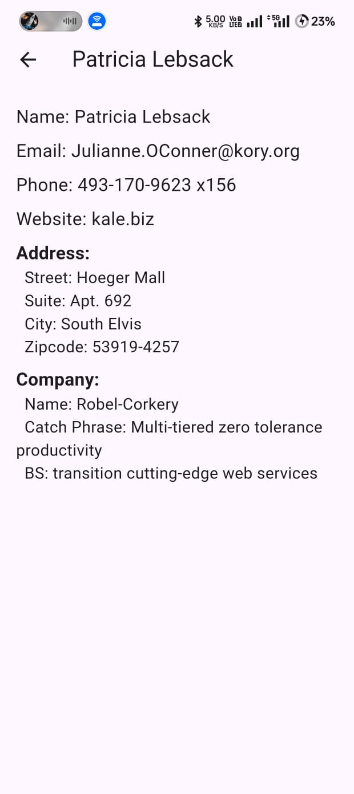

# UserList App

## Project Description

User List App is a Flutter application that fetches user data from a public API and displays a list of users with their names and email addresses. The app includes features like loading indicators, pull-to-refresh functionality, error handling, and a search feature. Users can also view more details about each user on a separate screen.

## Features

- **Loading Indicator:** Displays a loading spinner while fetching data from the API.
- **User List:** Shows a list of users with their names and email addresses.
- **Pull-to-Refresh:** Allows users to refresh the list of users by pulling down.
- **Error Handling:** Handles API request failures and shows appropriate error messages.
- **Search Functionality (Bonus):** Filter users by name using a search bar.
- **Detail Screen (Bonus):** Displays detailed information about a user when a list item is tapped.

## Screenshots




## Installation and Setup

To get the app running on your local machine, follow these steps:

1. **Clone the repository:**

    ```bash
    git clone https://github.com/pawan-kumawat/UserList_App
    ```

2. **Navigate into the project directory:**

    ```bash
    cd UserList_App
    ```

3. **Install the dependencies:**

    ```bash
    flutter pub get
    ```

4. **Run the app:**

    ```bash
    flutter run
    ```

## Assumptions and Decisions

- **State Management:** The app uses [Provider](https://pub.dev/packages/provider) for state management to handle user data and loading states.
- **Error Handling:** Simple error messages are displayed using a SnackBar in case of API request failures.
- **UI/UX:** The app follows Flutter’s design principles to ensure a clean and intuitive user interface.

## Bonus Features

- **Search Functionality:** Added a search bar to filter users by name.
- **Detail Screen:** Implemented a separate screen to show additional user details when a user is tapped.

## Code Quality

- The code is organized into modular components and follows Dart’s style guide and best practices.
- Custom widgets are used to maintain clean and reusable code.

## Error Handling

- Proper error handling is implemented to show user-friendly messages when API requests fail or when there are connectivity issues.

## Contact

For questions or feedback, please reach out to [finite.flutter@gmail.com](mailto:finite.flutter@gmail.com).

## Acknowledgements

- Thanks to the Flutter team for their excellent framework and tools.
- [JSONPlaceholder](https://jsonplaceholder.typicode.com/users) for providing the public API used in this project.